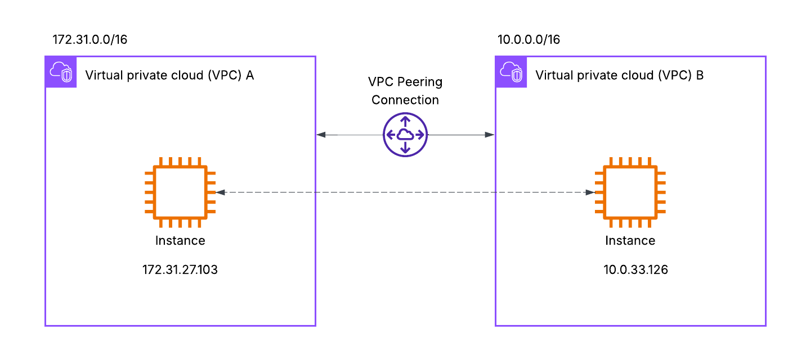
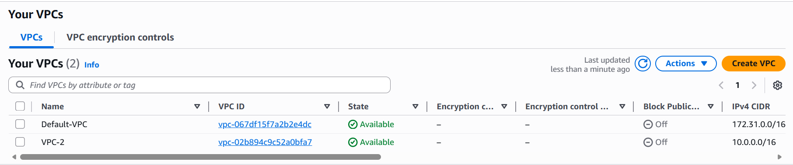
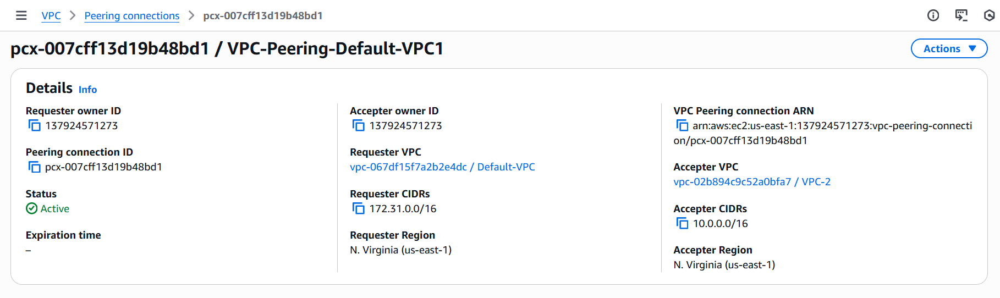
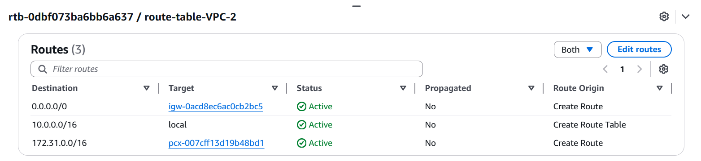
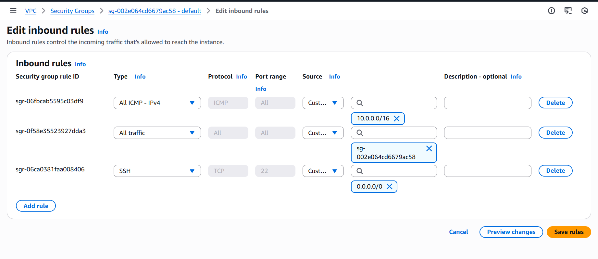
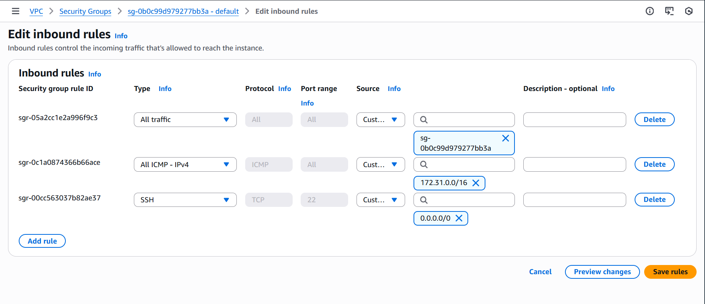
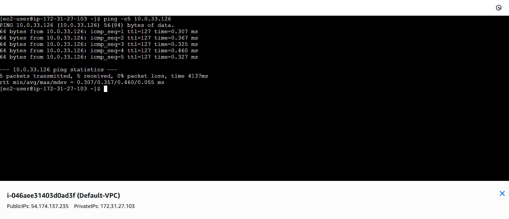
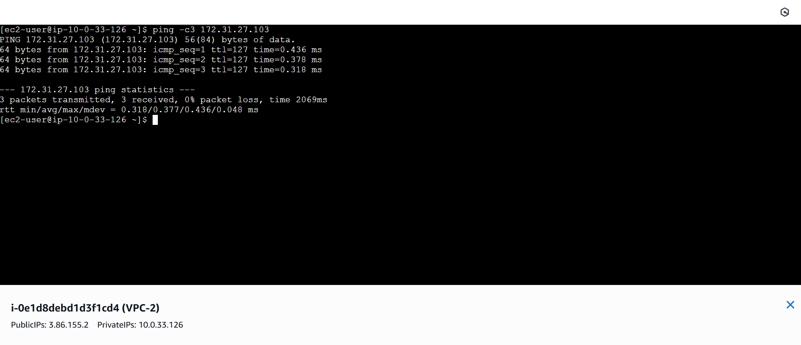
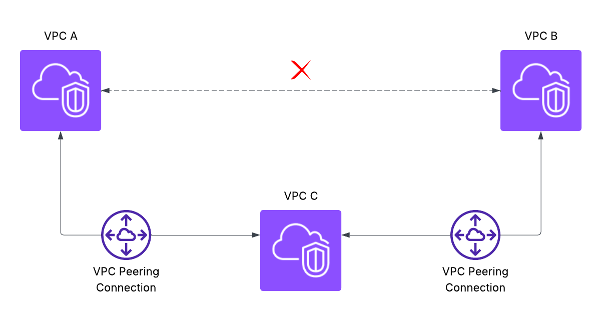

# AWS Virtual Private Cloud (VPC)

A Virtual Private Cloud (VPC) is a logically isolated virtual network within AWS where you can securely launch and manage resources.

It provides complete control over:

- IP address ranges
- Subnets
- Routing
- Security policies
- Network gateways

Think of a VPC as your private data center inside the AWS Cloud.


## Key Characteristics

- Region-specific resource
- Fully isolated networking environment
- Supports IPv4 and IPv6
- Highly scalable
- Secure by default


## Example VPC CIDR

```text
VPC CIDR: 10.0.0.0/16

This provides 65,536 private IP addresses.

Calculation:

Total IPs = 2^(32 − subnet bits)
= 2^(32 − 16)
= 2^16
= 65,536 IP addresses
```

## Core Components of a VPC

### 1. Subnets

A subnet is a subdivision of a VPC’s IP address range.

#### Types of Subnets

| Type           | Purpose                         |
|----------------|---------------------------------|
| Public Subnet  | Internet-facing resources       |
| Private Subnet | Internal application services   |


### 2. Internet Gateway (IGW)

An Internet Gateway (IGW) allows resources in a public subnet to communicate with the internet.

#### Functions

- Enables inbound and outbound internet traffic
- Attached at the VPC level


### 3. Route Tables

Route tables determine where network traffic is directed.

#### Example Routes

| Destination | Target            |
|-------------|------------------|
| 10.0.0.0/16 | local            |
| 0.0.0.0/0   | Internet Gateway |

Each subnet must be associated with a route table.


### 4. Security Groups

Security Groups act as stateful virtual firewalls for instances.

#### Characteristics

- Allow rules only
- Stateful (response traffic automatically allowed)
- Applied at resource level


### 5. Network ACL (NACL)

Network ACLs provide subnet-level security.

| Feature   | Security Group | NACL          |
|-----------|---------------|---------------|
| Level     | Instance      | Subnet        |
| Stateful  | Yes           | No            |
| Rules     | Allow only    | Allow & Deny  |


### 6. NAT Gateway

A NAT Gateway allows instances in private subnets to access the internet without being publicly exposed.

#### Example Use Cases

- OS updates
- Package downloads
- API access


## Why Multiple VPCs?

Organizations often create multiple VPCs for:

- Environment isolation (Dev / Stage / Prod)
- Team separation
- Security boundaries
- Microservice architectures
- Multi-account AWS setups

However, isolated VPCs cannot communicate by default.

This leads to the need for VPC connectivity solutions.


# VPC Peering

## What is VPC Peering?

VPC Peering enables private communication between two VPCs using AWS’s internal network.

Traffic never traverses the public internet.


## Architecture Overview


## Implementation Steps

### Step 1 — Create Two VPCs

| VPC   | CIDR Block     |
|-------|----------------|
| VPC-A | 172.31.0.0/16    |
| VPC-B | 10.0.0.0/16    |



### Step 2 — Create Peering Connection

1. Go to VPC → Peering Connections in AWS Console.
2. Create a peering request from the requester VPC.
3. Accept the request from the peer VPC.



### Step 3 — Update Route Tables

Add routes in both VPCs so traffic can flow between them.

- Destination: Peer VPC CIDR
- Target: Peering Connection (`pcx-id`)

#### Example Routes



### Step 4 — Update Security Groups

Allow traffic from the both VPC CIDR block in Security Group.

### Example

- Source: `172.31.0.0/16`
- Type: Required ports (ICMP, SSH, HTTP, etc.) or All traffic (for testing)




### Step 5 — Test Connectivity

- Launch EC2 instances in both VPCs.
- Use private IP addresses to test connectivity.
- Verify using:
  - `ping`
  - `ssh`
  - application-level requests




### VPC Peering Limitations

### Non-transitive routing


VPC peering are not transitive means only VPC A & VPC C | VPC B & VPC C can communicate even if VPC A & VPC B both are connected to VPC C still VPC A & VPC B can not communicate with each other if you want you need to create a peering conectivity between VPC A & VPC B.

other limitations, complex mesh architecture at scale & no centralized routing control.

# AWS Transit Gateway (TGW)

As environments grow, managing connectivity using VPC Peering becomes complex and difficult to scale.
AWS Transit Gateway (TGW) solves this problem by acting as a central networking hub that connects multiple VPCs and on-premises networks.

Transit Gateway enables a hub-and-spoke architecture, simplifying routing and improving scalability.

### What is a Transit Gateway?

An AWS Transit Gateway is a regional networking service that connects:

- Multiple VPCs
- VPN connections
- On-premises networks
- AWS Direct Connect gateways

It works as a central router for your cloud network, simplifying connectivity and enabling scalable network architecture.

## Why Not Use Only VPC Peering?

When multiple VPCs need communication, VPC Peering creates a mesh topology.

Example (Peering Mesh Problem)
```text
VPC A <--> VPC B
VPC A <--> VPC C
VPC B <--> VPC C
```

Connections increase rapidly as VPC count grows.

| Number of VPCs | Required Peerings |
| -------------- | ----------------- |
| 2              | 1                 |
| 3              | 3                 |
| 5              | 10                |
| 10             | 45                |

Consumes lot of time & becomes operationally difficult.

### Transit Gateway Solution

Instead of connecting VPCs to each other, all VPCs connect to one central gateway.
